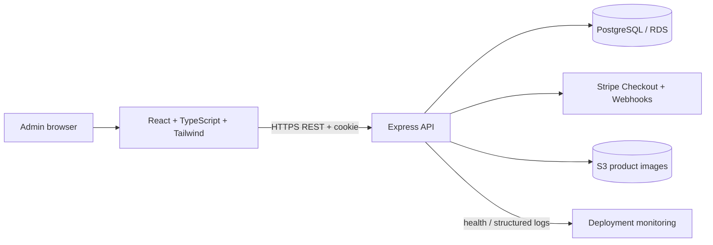

# Mini E-commerce Store — Implementation Plan

## Goal
Build a responsive full-stack store with customer and administrator flows, PostgreSQL-backed inventory and orders, Stripe test checkout, image uploads, and an AWS deployment path. Deliver in small vertical slices so the app stays runnable as features are added.

## Decisions and scope
- **Code language:** Use strict TypeScript throughout (React components in TSX and Express server in TS), following the repository's `AGENTS.md` instructions. This intentionally tightens the pasted brief's JavaScript suggestion.
- **Initial architecture:** A single repository with `frontend/` and `backend/`, plus database migrations and seed data. Keep the API modular by domain.
- **Authentication:** JWT in secure, HTTP-only cookies; same auth system for users and admins, with server-side role checks. Logout clears the cookie.
- **Checkout consistency:** Create a pending order and Stripe Checkout Session from server-calculated prices; finalize payment and decrement stock exactly once after a verified webhook, using a DB transaction and row locks. Handle cancelled/expired sessions and webhook retries idempotently.
- **Images:** Persist S3 object keys and metadata in PostgreSQL; use a storage service interface so local development can use a local/test adapter.
- **MVP boundary:** Required storefront, cart, checkout, order history, admin catalog/variants/inventory/orders, and deployable infrastructure. Optional ratings, contact page, CloudFront, and custom domain can follow core functionality.

## Architecture

## Phases and completion criteria

### 1. Foundation and local development
- Establish frontend/backend workspace, strict TS configs, formatting/lint conventions, and environment examples.
- Configure React, routing, Tailwind, Express, request parsing, security headers, CORS, rate limiting, structured errors, health endpoint, and environment validation.
- Add PostgreSQL connection and migration workflow; document one-command local startup and required services.
- **Done when:** both apps start locally, `/health` works, DB connectivity is checked, and no secrets are committed.

### 2. Data model and seed data
- Create migrations for users, categories, products, variants, product images, carts/cart items, orders/order items, payments, and inventory transactions.
- Add foreign keys, unique email/slug/SKU constraints, nonnegative stock/quantity and valid money constraints, useful indexes, and timestamps.
- Define order/payment statuses and store immutable product/variant/price snapshots on order items.
- Seed sample categories, products, variants, and a development admin created through a safe documented process.
- **Done when:** migrations apply cleanly to a fresh PostgreSQL database and seed data is usable.

### 3. Authentication and authorization
- Implement registration, login, logout, current-user endpoint, password hashing, cookie-backed JWT issuance/validation, and input validation.
- Add user/admin route guards and frontend auth state, protected routes, forms, loading/error states, and accessible feedback.
- Add auth endpoint rate limits and ensure admin provisioning is not public registration.
- **Done when:** a user can register/login/logout; authenticated and admin-only routes enforce roles server-side.

### 4. Public catalog
- Implement category and product read APIs with search, filters, sorting, and pagination; expose only active products/variants.
- Build responsive home, catalog, and detail pages with image galleries, variant/stock selection, and empty/loading/error states.
- **Done when:** a visitor can browse and find products on mobile and desktop, and unavailable variants cannot be selected.

### 5. Persistent cart
- Add authenticated cart endpoints to read/add/update/remove items. Enforce unique cart+variant items and validate quantity/availability.
- Calculate all prices and totals on the server; return a cart summary. Add optimistic UI updates with rollback and clear error feedback.
- **Done when:** cart survives reload/login and clients cannot alter authoritative price or stock.

### 6. Orders and Stripe test checkout
- Collect/validate shipping and contact details; create pending order snapshots from the DB cart.
- Create Stripe Checkout Session server-side and associate session/payment records with the order.
- Implement raw-body webhook verification, idempotency, payment failure/expiry handling, and success return page that fetches server order state.
- On confirmed payment, lock affected variants, verify stock, decrement inventory, record inventory transactions, update order/payment, and clear cart atomically. Define compensation/refund or exception handling if stock is unavailable at confirmation time.
- **Done when:** test-mode success/failure/cancel/retry flows produce correct order, payment, stock, and cart state without duplicate decrements.

### 7. Customer account and order history
- Add profile read/update, paginated order history, and authorized order detail endpoints/pages.
- **Done when:** users can access only their own profile and orders and see purchase-time snapshots/statuses.

### 8. Admin operations
- Add dashboard metrics, product/category/variant CRUD, product availability, image metadata management, inventory adjustments with audit records, low-stock views, and order status management.
- Restrict mutations to admins; validate legal order transitions and avoid overwriting payment state through fulfillment actions.
- Build accessible responsive admin navigation, forms, tables, confirmation dialogs, loading, and error states.
- **Done when:** admins can manage catalog, stock, images, and fulfillment; normal users receive forbidden responses for admin APIs.

### 9. S3 image upload
- Add admin-only upload flow with MIME/size validation, randomized safe object keys, S3 upload, and persisted metadata; never accept arbitrary bucket URLs from clients.
- Configure least-privilege IAM and private/public delivery policy (or signed URLs) for the chosen product image access model.
- **Done when:** valid images upload and render, while invalid/oversized files are rejected and metadata remains consistent on failure.

### 10. Release readiness and AWS deployment
- Add production build and deployment documentation/config for frontend hosting, Express on EC2, RDS PostgreSQL, S3, TLS, secrets, CORS, backups, and migrations.
- Add health checks, structured logs, database connection/pool settings, HTTPS-only cookies, and operational rollback notes. Keep CloudFront/Route 53 optional.
- Run the requested functional, authorization, transaction, payment webhook, responsive, and accessibility checks; resolve release blockers.
- **Done when:** a clean production-like environment can be deployed from documented steps and critical flows are verified end to end.

## Cross-cutting requirements
- TypeScript strict mode; React functional components and hooks; Tailwind utilities; semantic and keyboard-accessible UI.
- Centralized API error shape, backend validation, parameterized SQL, secure headers, CORS allowlist, and comprehensive handling of async failures.
- No client-trusted prices/roles/stock. Secrets stay server-side and out of version control.
- Use transactions and idempotency for payment/order/inventory mutations; preserve audit history.
- Provide loading, empty, success, and error states; use optimistic cart updates only where rollback is reliable.

## Key risks and mitigations
| Risk | Mitigation |
|---|---|
| Webhook retries or out-of-order payment events | Verify signatures, persist event/session IDs, make handlers idempotent, and guard state transitions. |
| Concurrent buyers oversell inventory | Lock variant rows and validate/decrement within one transaction at payment finalization; define unavailable-stock recovery. |
| Auth token theft or unsafe browser storage | Use secure HTTP-only, SameSite cookies, HTTPS in production, CSRF protection appropriate to cookie auth, and short-lived tokens. |
| S3 upload/database partial failure | Use explicit upload lifecycle and cleanup/reconciliation for orphaned objects. |
| Deployment secrets/configuration drift | Validate required env at startup, document AWS secret configuration, and never commit `.env`. |

## Delivery order
Complete phases 1–3 first, then deliver the customer purchase path (4–7), then admin and uploads (8–9), and finish with release/deployment (10). Keep each phase independently reviewable and runnable.
